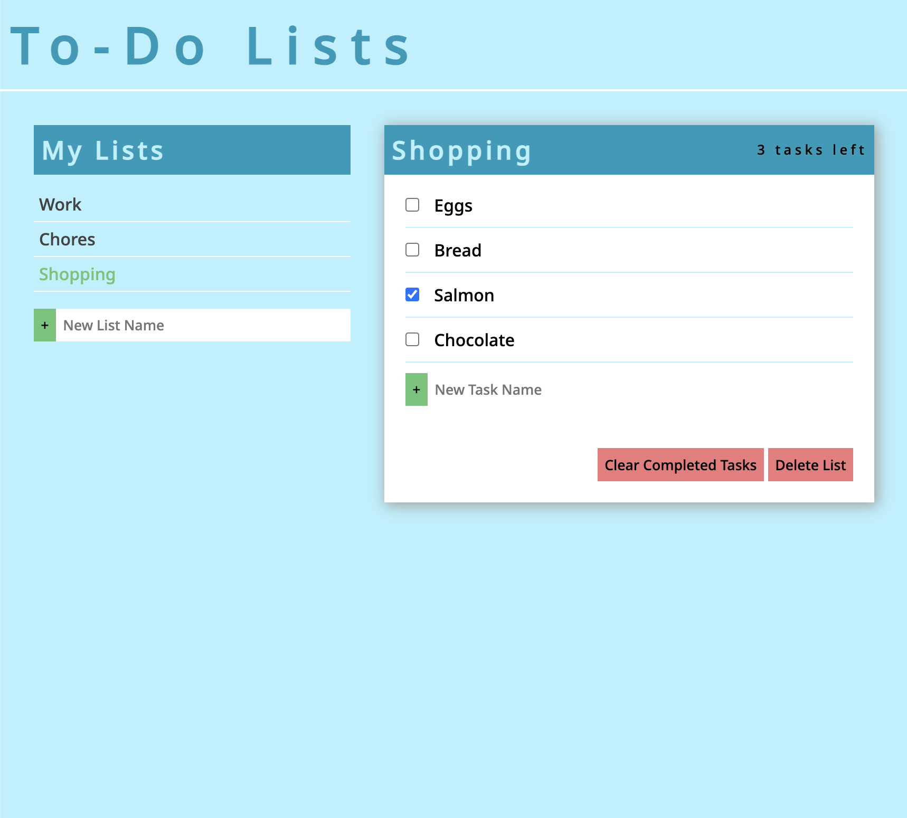

# ListEasy-To-Do-List

## Overview

This repository contains the source code for a Spanish flashcard app app. The app allows you to create lists of tasks to streamline your day, and boost your efficiency. Never miss a deadline or forget an important task again! Built with vanilla JS!

## Features

- Create and delete lists.
- Create and delete tasks.
- User-Friendly interface.
- Mark tasks as completed when you finish them.
- Keeps track of tasks remaining.
